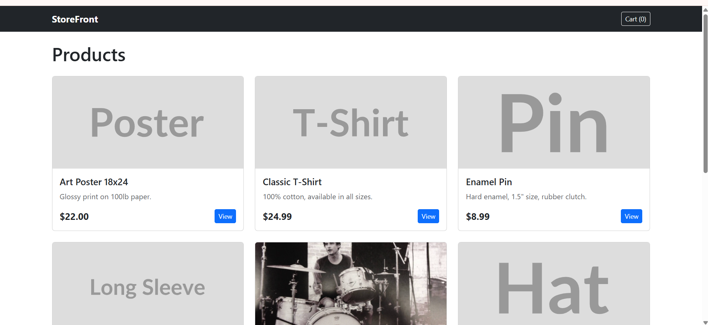

# StoreFront

A classic Rails MVC storefront with public product browsing, session-based cart, order placement, and a Devise-protected admin panel for managing products.

**Live at:** https://store.jpredmon.com



Built with Rails 8.1.3, PostgreSQL, Bootstrap 5, and Minitest.

## Features

**Public storefront** (no login required):
- Browse products with image cards
- Product detail pages
- Session-based cart (add, update quantity, remove)
- Checkout with customer name/email
- Order confirmation page
- Mobile-responsive layout

**Admin panel** (`/admin`):
- Devise authentication
- Full CRUD for products (create, edit, delete)
- Separate admin layout
- Admin login at `/admin/login` (no public link by design)

## Live deployment

Hosted on [Render](https://render.com) with [Cloudflare](https://cloudflare.com) as DNS proxy and SSL termination.

- **URL:** https://store.jpredmon.com
- **Render service:** Docker-based, auto-deploys from GitHub `master` branch
- **Database:** Render PostgreSQL
- **SSL:** Cloudflare Full (Strict) mode

The free Render tier spins down after 15 minutes of inactivity. First visit after sleep takes ~30 seconds.

## Local setup

```sh
# Install dependencies
bundle install

# Create and migrate the database
rails db:create
rails db:migrate

# Seed sample data (8 products + 1 admin user)
rails db:seed

# Start the server
rails server
```

Then open http://localhost:3000.

## Admin access

**Local (after seeding):**
- URL: http://localhost:3000/admin/login
- Email: `admin@storefront.dev`
- Password: `password123`

**Production:**
- URL: https://store.jpredmon.com/admin/login
- Credentials configured via `ADMIN_EMAIL` and `ADMIN_PASSWORD` environment variables on Render

## Tests

```sh
rails test
```

43 tests covering models (Product, Order, OrderItem, Cart), public controllers (Products, Cart, CartItems, Orders), and admin controllers (Admin::Products).

## Tech stack

- Ruby 3.3, Rails 8.1.3
- PostgreSQL
- Devise 5.0 (admin auth)
- Bootstrap 5 (CDN)
- Propshaft (asset pipeline)
- Turbo + Stimulus (via importmap)
- Minitest

## Architecture

- Server-rendered MVC -- no SPA, no JS framework
- Cart is a plain Ruby class wrapping the session hash (no database table)
- Prices stored as integers (`price_cents`) to avoid floating-point issues
- `Product#price=` virtual setter converts dollar input to cents
- Order placement wrapped in a database transaction for atomicity
