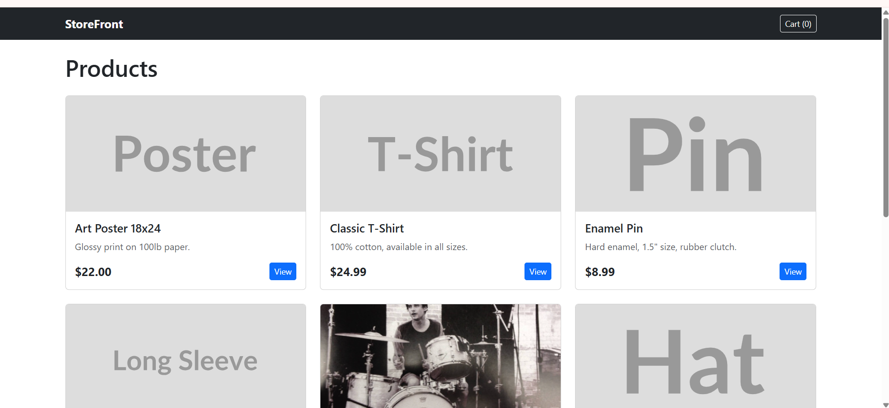

# StoreFront

A classic Rails MVC storefront with public product browsing, session-based cart, order placement, and a Devise-protected admin panel for managing products.



Built with Rails 8.1.4, PostgreSQL, Bootstrap 5, and Minitest.

## Features

**Public storefront** (no login required):
- Browse products with image cards
- Product detail pages
- Session-based cart (add, update quantity, remove)
- Checkout with customer name/email
- Order confirmation page
- Mobile-responsive layout

**Admin panel** (`/admin`):
- Devise authentication
- Full CRUD for products (create, edit, delete)
- Separate admin layout
- Admin login at `/admin/login` (no public link by design)

## Live deployment

Hosted on [Render](https://render.com) with [Cloudflare](https://cloudflare.com) as DNS proxy and SSL termination.

- **URL:** https://store.jpredmon.com
- **Render service:** Docker-based, auto-deploys from GitHub `master` branch
- **Database:** Render PostgreSQL
- **SSL:** Cloudflare Full (Strict) mode

The free Render tier spins down after 15 minutes of inactivity. First visit after sleep takes ~30 seconds.

## Local setup

**Prerequisites:** Ruby 3.3.11 (see `.ruby-version`), PostgreSQL 16 or newer running on `localhost:5432`.

```sh
# 1. Create the database user the app connects as (see config/database.yml)
psql -U postgres -c "CREATE ROLE storefront WITH LOGIN PASSWORD 'storefront' CREATEDB;"

# 2. Install gems
bundle install

# 3. Create the development and test databases, then load the schema
#    and seed sample data (8 products + 1 admin user)
bin/rails db:create
bin/rails db:prepare

# 4. Start the server
bin/rails server
```

Then open http://localhost:3000.

- **macOS (Homebrew Postgres):** the superuser is your macOS account, not `postgres`, so step 1 is `psql postgres -c "CREATE ROLE ..."`.
- **Windows (PowerShell):** run the Rails commands as `ruby bin/rails ...`. Run them from the project folder spelled with its exact capitalization (`StoreFront`); a differently-cased path breaks Rails' view lookup on Windows.

## Admin access

**Local (after seeding):**
- URL: http://localhost:3000/admin/login
- Email: `admin@storefront.dev`
- Password: `password123`

**Production:**
- URL: https://store.jpredmon.com/admin/login
- Credentials configured via `ADMIN_EMAIL` and `ADMIN_PASSWORD` environment variables on Render

## Tests

```sh
bin/rails test          # 62 model and controller tests
bin/rails test:system   # 11 browser tests (requires Google Chrome)
```

- **Model and controller tests:** Product, Order, OrderItem and Cart, the public controllers (Products, Cart, CartItems, Orders), and Admin::Products.
- **System tests:** drive headless Chrome through the shopper flow (browse, cart, checkout, validation errors, phone-width layout) and the admin flow (login, create, edit, delete with confirmation, logout).

GitHub Actions runs both suites on every pull request and every push to `master`, along with RuboCop, Brakeman (static security analysis), and bundler-audit (known-vulnerable gems).

## Tech stack

- Ruby 3.3, Rails 8.1.4
- PostgreSQL
- Devise 5.0 (admin auth)
- Bootstrap 5 (CDN)
- Propshaft (asset pipeline)
- Turbo + Stimulus (via importmap)
- Minitest

## Architecture

- Server-rendered MVC -- no SPA, no JS framework
- Cart is a plain Ruby class wrapping the session hash (no database table)
- Prices stored as integers (`price_cents`) to avoid floating-point issues
- `Product#price=` virtual setter converts dollar input to cents with `BigDecimal`, not `Float`, so `19.99` is exactly 1999 cents
- Products that appear in orders can't be deleted (`restrict_with_error`), preserving order history
- An order confirmation page is only viewable from the browser session that placed the order
- Order placement wrapped in a database transaction for atomicity
